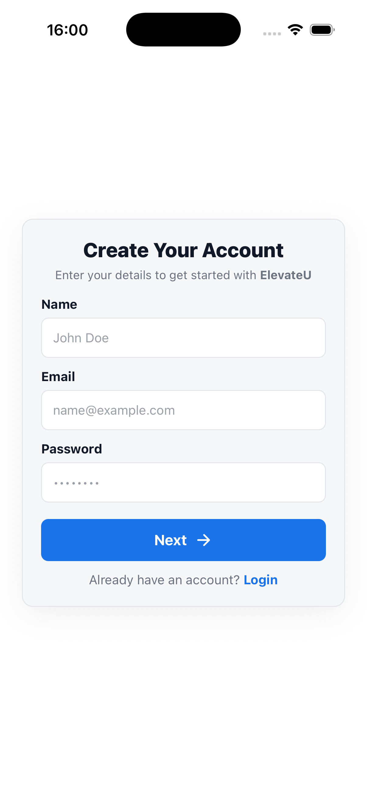
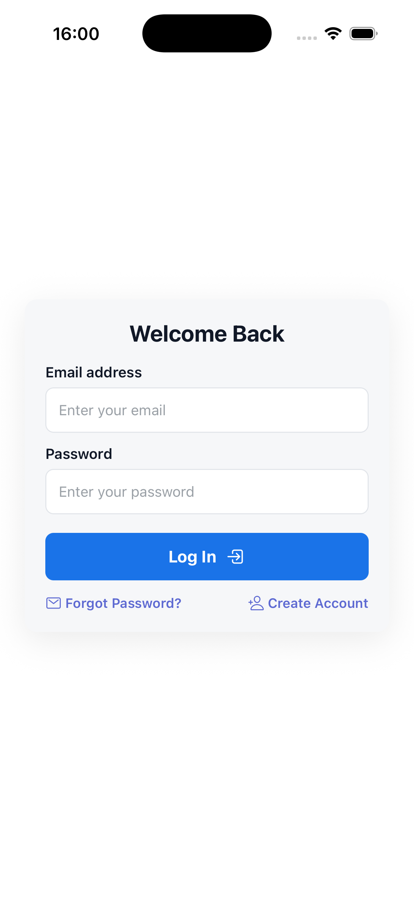
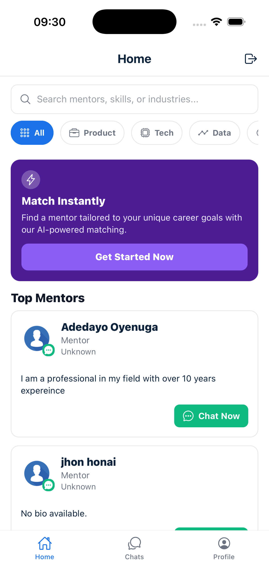
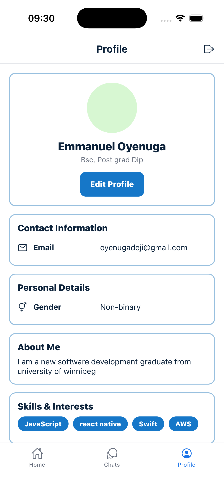
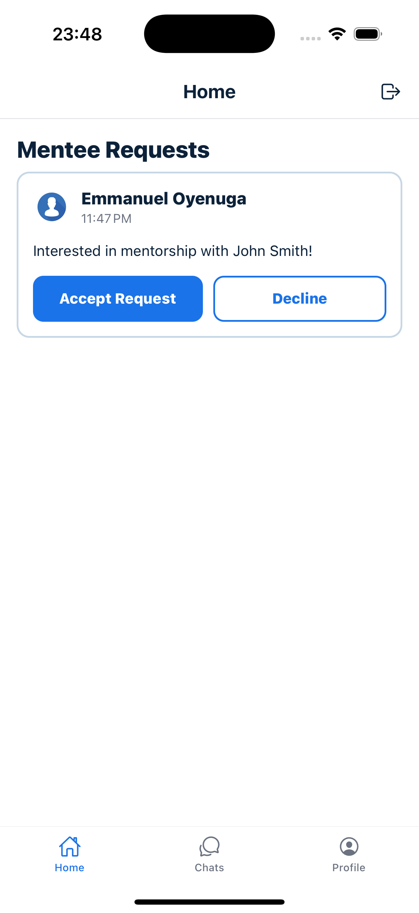
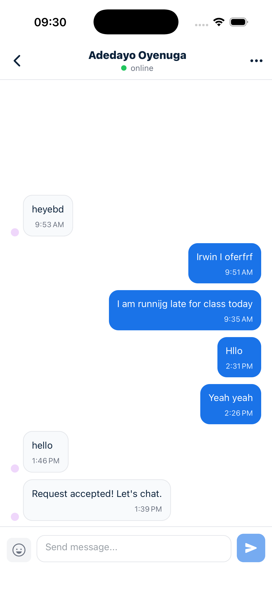
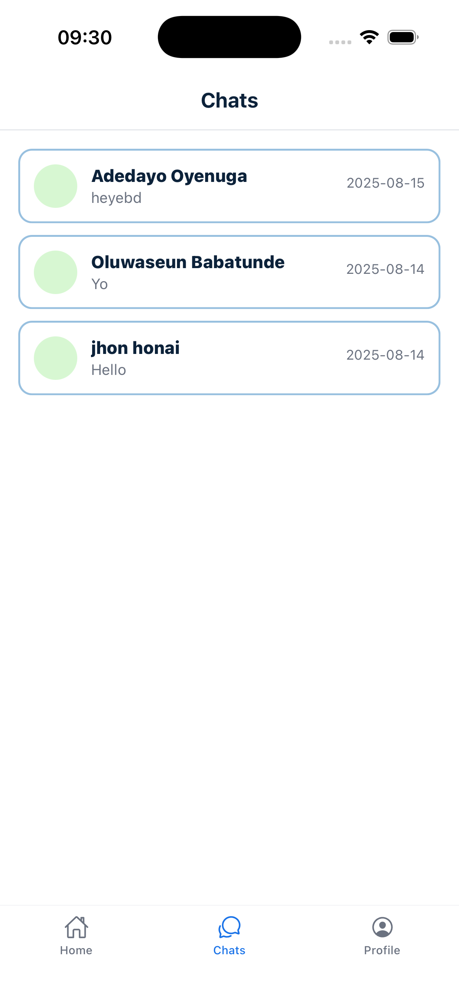

# ElevateU – Mentorship & Career Growth Platform

ElevateU is a mobile application designed to connect mentors and mentees, streamline communication, and support professional development. Built with **React Native**, **Firebase**, and a clean modular architecture, ElevateU focuses on simplicity, accessibility, and real-world impact.

---

## 🚀 Features

- User authentication (email/password, Firebase Auth)
- Mentor/Mentee matching
- Real-time chat and messaging
- Profile creation & editing
- Session scheduling
- Resource sharing
- Clean UI with reusable components

---

## 📱 App Screenshots

### Onboarding & Authentication

<table>
  <tr>
    <td align="center">
      
       Signup
    </td>
    <td align="center">
      
       Login
    </td>
  </tr>
</table>

### Dashboard & Matching

<table>
  <tr>
    <td align="center">
      
    </td>
    <td align="center">
      
    </td>
    <td align="center">
      
    </td>
  </tr>
</table>

### Chat Screens

<table>
  <tr>
    <td align="center">
      
    </td>
    <td align="center">
      
    </td>
  </tr>
</table>

---

## 🛠️ Tech Stack

| Layer | Technology |
|-------|------------|
| Frontend | React Native (Expo or CLI) |
| State Management | Context API |
| Backend | Firebase Firestore |
| Authentication | Firebase Auth |
| Storage | Firebase Storage |
| Architecture | Modular, MVVM-inspired structure |

---

## 📂 Project Structure (Example)

## 👤 Developer

**Emmanuel Oyenuga**  
Mobile App Developer – Winnipeg, MB 
